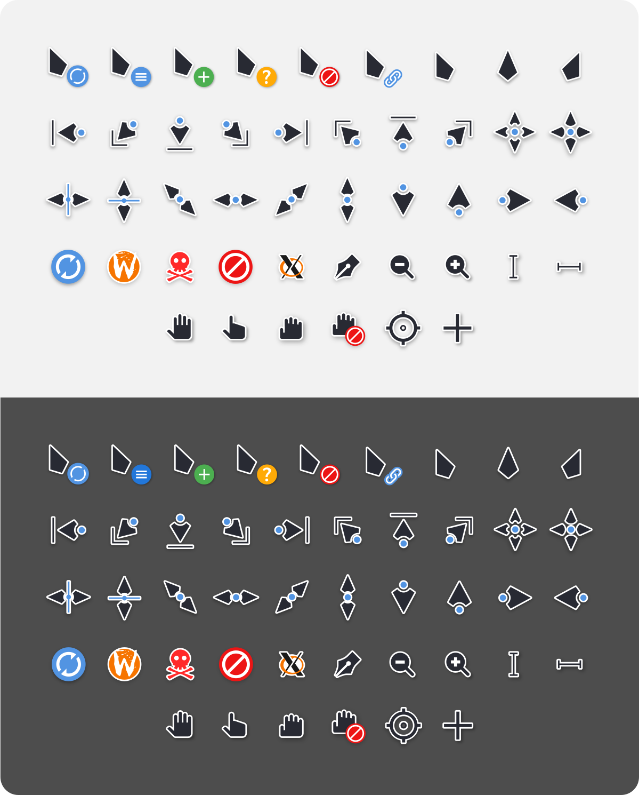
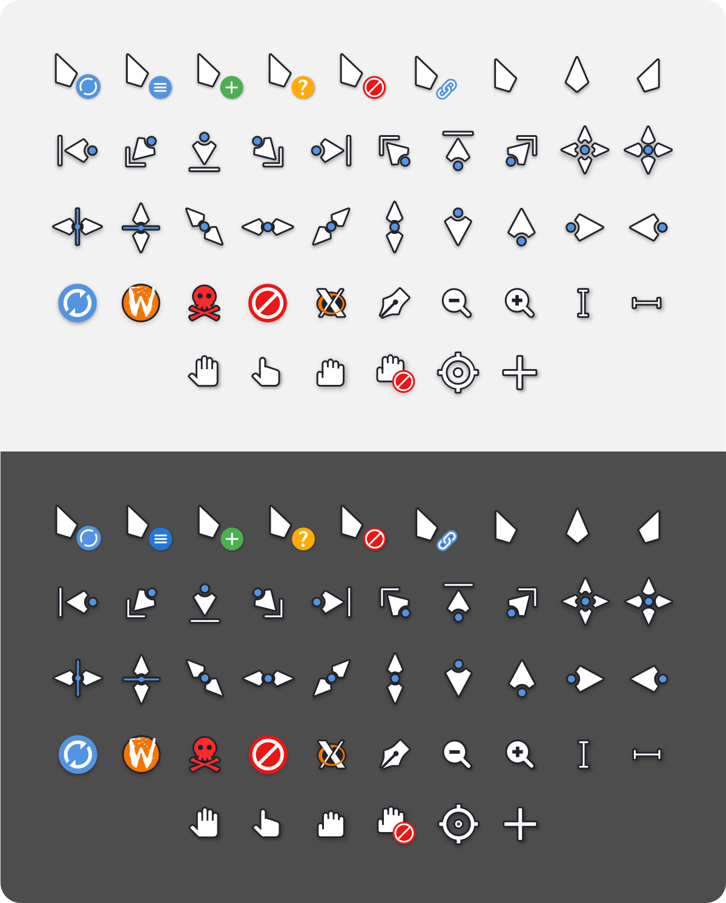

# Qogir cursors with *fucking* 

## Look, I like these cursors. 
## I neeeed them. 

And Plasma just removed them from cursor themes today! (after updating to Plasma 6.6).

So I tried building from source....

And the build system is..... hmmmmmm...

I made my own `better_fucking_build.sh` file.

It builds the cursors from the svgs using `inkscape` and `xcursorgen`, for any given size.

### Build & Install

I need size `40`. 

If you want something else, edit the `SIZES` variable in the custom build script.

I also modified the `install.sh` file to only install the required theme. I don't need the manjaro or ubuntu versions.

So, just change the `SIZES` variable in my ***custom*** build script.

runit

install using `install.sh`

### About hotspots

Turns out the real hotspot data lives inside the `scalable` folder.

Right now the script approximates hotspots while generating cursors.

One day I might make the scaling + hotspots fully correct.

For now: size 40 works perfectly for me. For now...

Good enough.

---
# Please listen...

### I did not want to fork the entire Qogir icon theme repo. 

### I only care about the cursors.

### To be very clear:

- I did not create these cursors.

- I do not own the artwork.

- TThey come from the original Qogir Icon Theme and are licensed under GPLv3.

- Find the original license at [License](./LICENSE).

### This repository contains:

- Cursor SVG source files (source)

- A custom build script

- A modified install script

### Changes

- I added a new build script, that's all.

### The [Authors](./AUTHORS) file is from original repo. Bit modified at the  end by me.
### Check [Notice](./NOTICE) for changes.


- [x] Same License.

- [x] I have mentioned the changes I made as stipulated by the license.

- [x] included the source for building the cursors.. duh.. svgs

- [x] Gave the notice and authors files


==> Hence, This repo is also lisenced under **GPLv3**.

And I am not using this for any commercial purposes. Just eye-candy.

K. Bye.

Information about the source repo is found below.

--- 

---

---
# Original Repo link: [Qogir-icon-theme](https://github.com/vinceliuice/Qogir-icon-theme)

## Cursors found inside `src/cursors` in the original repo.

## What follows is the original README inside `src/cursors` 

This is an x-cursor theme inspired by Qogir theme and
based on [capitaine-cursors](https://github.com/keeferrourke/capitaine-cursors).

Windows version [Qogir-cursors](https://github.com/CodyJH/Qogir-Cursors-Windows)

## Installation
To install the cursor theme simply copy the compiled theme to your icons
directory. For local user installation:

```
./install.sh
```

For system-wide installation for all users:

```
sudo ./install.sh
```

Then set the theme with your preferred desktop tools.

## Building from source
You'll find everything you need to build and modify this cursor set in
the `src/` directory. To build the xcursor theme from the SVG source
run:

```
./build.sh
```

This will generate the pixmaps and appropriate aliases.
The freshly compiled cursor theme will be located in `dist/`

## Preview


